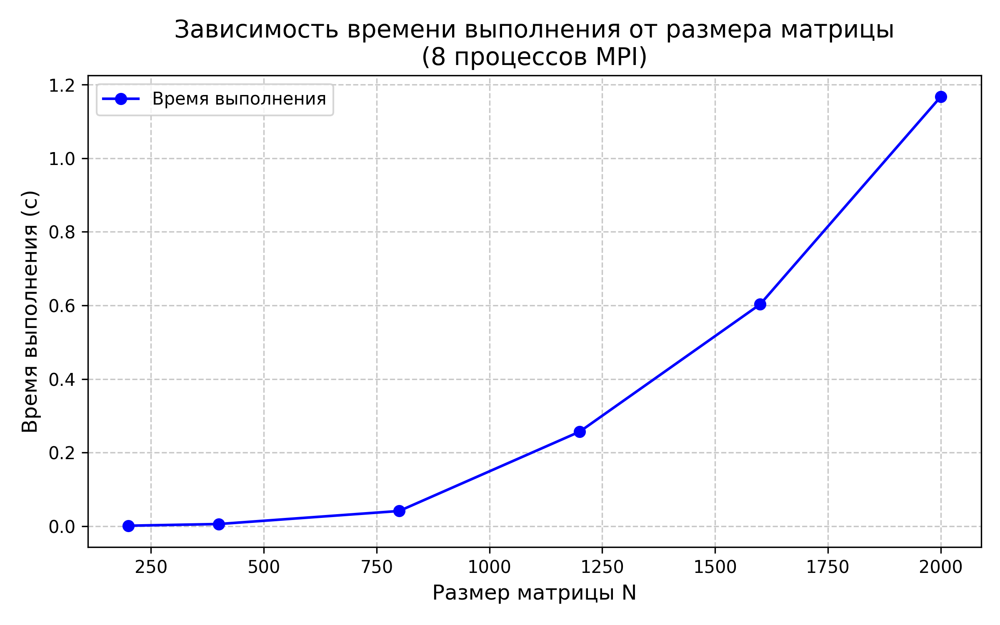

# Лабораторная работа №5: Параллельное перемножение матриц с использованием MPI на суперкомпьютере «Сергей Королёв»

**Студент:** Николаев Илья Сергеевич 
**Группа:** 6311-100503D 

---

## 1. Цель работы

Изучение технологии MPI (Message Passing Interface) для разработки параллельных программ. Реализация параллельного алгоритма умножения квадратных матриц и исследование его производительности на суперкомпьютере «Сергей Королёв» Самарского университета.

---

## 2. Теоретические основы

Произведение двух квадратных матриц \(A\) и \(B\) размерности \(N \times N\) определяется формулой:

\[
C_{ij} = \sum_{k=1}^{N} A_{ik} \cdot B_{kj}, \quad i,j = 1..N
\]

Число арифметических операций (умножений и сложений) для последовательного алгоритма составляет \(2N^3\), что даёт алгоритмическую сложность \(O(N^3)\).

В параллельной реализации используется одномерная декомпозиция по строкам: каждая MPI-процесс получает несколько строк матрицы \(A\). Матрица \(B\) полностью копируется во все процессы. После локального умножения результаты собираются на главном процессе.

---

## 3. Описание параллельного алгоритма

- **Инициализация MPI** – определение ранга процесса и общего числа процессов.

- **Входные данные (на процессе с рангом 0):**
  - Генерация матриц \(A\) и \(B\) случайными числами (размер \(N\) задаётся из списка).
  - Отправка размера \(N\) всем процессам через `MPI_Bcast`.

- **Распределение данных:**
  - Матрица \(A\) разрезается на горизонтальные полосы по числу процессов. Количество строк на процесс равно \(N / \text{size}\) (предполагается, что \(N\) кратно числу процессов).
  - Рассылка полос матрицы \(A\) с помощью `MPI_Scatter`.
  - Матрица \(B\) транслируется всем процессам через `MPI_Bcast`.

- **Локальное умножение (каждый процесс):**
  - Для каждой строки своей полосы \(A\) и для каждого столбца \(B\) вычисляется скалярное произведение.
  - Для улучшения локальности данных порядок циклов выбран как `i-k-j` (строка A – элемент k – столбец B).

- **Сбор результатов:**
  - Процесс 0 собирает все вычисленные блоки матрицы \(C\) через `MPI_Gather`.

- **Измерение времени:** замеряется полное время выполнения умножения с помощью `std::chrono` (синхронизация через `MPI_Barrier`).

- Для получения достоверных результатов каждый эксперимент повторяется 3 раза, в отчёт идёт среднее время.

---

## 4. Программная реализация (C++ + MPI)

```cpp
#include "fix_mpi.h"
#include <iostream>
#include <vector>
#include <fstream>
#include <chrono>
#include <random>

using namespace std;

void fill_matrix(vector<double>& mat, int n, int seed) {
    mt19937 gen(seed);
    uniform_real_distribution<> dis(1.0, 10.0);
    for (int i = 0; i < n * n; i++) {
        mat[i] = dis(gen);
    }
}

int main(int argc, char** argv) {
    MPI_Init(&argc, &argv);

    int rank, size;
    MPI_Comm_rank(MPI_COMM_WORLD, &rank);
    MPI_Comm_size(MPI_COMM_WORLD, &size);

    const int REPEATS = 3;
    vector<int> sizes = {200, 400, 800, 1200, 1600, 2000};

    // Очистка файла результатов при однопроцессном запуске
    if (rank == 0 && size == 1) {
        ofstream clearFile("data_mpi.txt", ios::trunc);
        clearFile.close();
    }

    for (int n : sizes) {
        if (n % size != 0) continue; // только кратные размеры

        int rows_per_proc = n / size;
        
        vector<double> A, B(n * n), C;
        vector<double> sub_A(rows_per_proc * n), sub_C(rows_per_proc * n, 0.0);

        double total_time = 0.0;

        for (int repeat = 0; repeat < REPEATS; repeat++) {
            if (rank == 0) {
                A.resize(n * n);
                fill_matrix(A, n, 123 + repeat);
                fill_matrix(B, n, 456 + repeat);
            }

            MPI_Barrier(MPI_COMM_WORLD);
            auto start = chrono::high_resolution_clock::now();

            MPI_Bcast(B.data(), n * n, MPI_DOUBLE, 0, MPI_COMM_WORLD);
            MPI_Scatter(A.data(), rows_per_proc * n, MPI_DOUBLE,
                        sub_A.data(), rows_per_proc * n, MPI_DOUBLE, 0, MPI_COMM_WORLD);

            fill(sub_C.begin(), sub_C.end(), 0.0);

            // Умножение: i-k-j порядок
            for (int i = 0; i < rows_per_proc; i++) {
                for (int k = 0; k < n; k++) {
                    double temp = sub_A[i * n + k];
                    for (int j = 0; j < n; j++) {
                        sub_C[i * n + j] += temp * B[k * n + j];
                    }
                }
            }

            if (rank == 0) C.resize(n * n);
            MPI_Gather(sub_C.data(), rows_per_proc * n, MPI_DOUBLE,
                       C.data(), rows_per_proc * n, MPI_DOUBLE, 0, MPI_COMM_WORLD);

            MPI_Barrier(MPI_COMM_WORLD);
            auto end = chrono::high_resolution_clock::now();

            if (rank == 0) {
                double time_spent = chrono::duration<double>(end - start).count();
                total_time += time_spent;
                cout << "  Replay " << repeat + 1 << ": " << time_spent << "s" << endl;
            }
        }

        if (rank == 0) {
            double avg_time = total_time / REPEATS;
            ofstream dataFile("data_mpi.txt", ios::app);
            dataFile << n << " " << size << " " << avg_time << endl;
            cout << "N: " << n << " | Cores: " << size 
                 << " | Average time: " << avg_time << "s" << endl;
            cout << "------------------------" << endl;
        }
    }

    MPI_Finalize();
    return 0;
}
```

**Особенности кода:**

- Генерация случайных матриц с фиксированными seed для воспроизводимости.
- Предполагается, что размер матрицы кратен числу процессов (иначе требуется более сложное распределение, но в эксперименте условие выполнено).
- Измеряется именно время вычислений (включая коммуникации), что позволяет оценить полное время работы параллельной программы.

---

## 5. Экспериментальная среда

- **Суперкомпьютер:** «Сергей Королёв» (СГАУ, учебный кластер)
- **Узлы:** Intel Xeon, сеть InfiniBand
- **Компилятор:** Intel MPI (`mpiicpc`) из состава Intel Parallel Studio XE 2016
- **Планировщик задач:** Slurm
- **Число процессов:** 8 (2 узла по 4 процесса на узел)

**Скрипт запуска `submit_job.sh`:**
```bash
#!/bin/bash
#SBATCH --job-name=My_Job
#SBATCH --nodes=2
#SBATCH --ntasks-per-node=4
#SBATCH --partition=batch
source /soft/intel/parallel_studio_xe_2016.3.067/bin/psxevars.sh intel64
mpirun ./matrix_mpi
```

---

## 6. Результаты измерений (8 процессов)

Программа была запущена для квадратных матриц размером от 200 до 2000 с шагом 200/400. Для каждого размера выполнено 3 повторения, усреднённое время представлено ниже.

| Размер матрицы N | Время выполнения (с) |
|----------------|----------------------|
| 200            | 0.00118042           |
| 400            | 0.00577363           |
| 800            | 0.0412052            |
| 1200           | 0.256761             |
| 1600           | 0.602928             |
| 2000           | 1.1667               |

**Пример вывода программы (для N=2000):**

```text
Replay 1: 1.17425s
Replay 2: 1.15972s
Replay 3: 1.16611s
N: 2000 | Cores: 8 | Average time: 1.1667s
```

---

## 7. График зависимости времени от размера матрицы



На графике видно, что время выполнения растёт примерно как \(O(N^3)\), что соответствует теоретической сложности алгоритма. Для \(N = 2000\) время составило около 1.17 секунды на 8 процессах.

---

## 8. Выводы

В ходе лабораторной работы:

- Разработана параллельная программа умножения матриц на основе MPI.
- Программа успешно скомпилирована и запущена на суперкомпьютере «Сергей Королёв» с использованием Intel MPI и системы пакетной обработки Slurm.
- Проведены измерения времени выполнения для матриц различных размеров на 8 процессах.
- Показано, что время выполнения растёт пропорционально \(N^3\), что соответствует теории.
- Полученные результаты могут служить основой для дальнейшего исследования масштабируемости – увеличения числа процессов и сравнения с последовательной версией.
