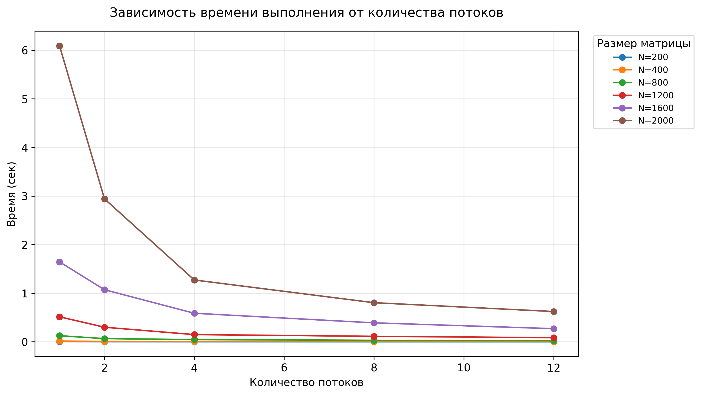
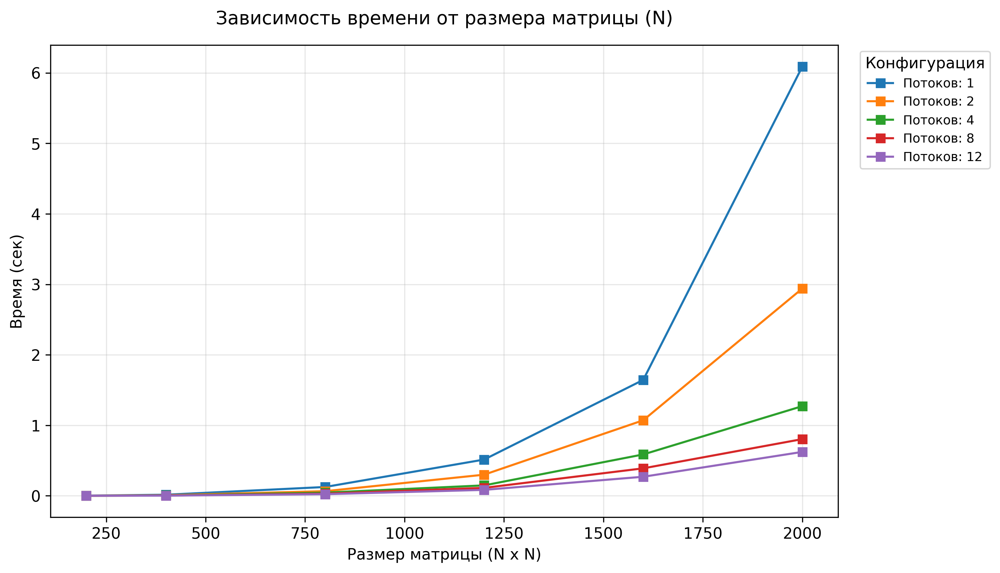
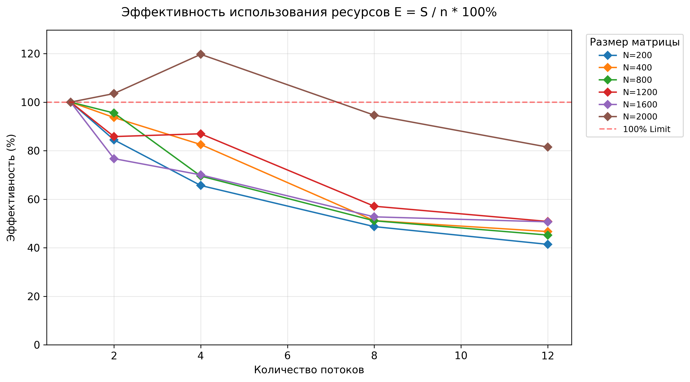

# Лабораторная работа №2: Параллельное умножение матриц (OpenMP)

**Студент**: Николаев Илья Сергеевич  
**Группа**: 6311-100503D

## 1. Цель работы
Изучение механизмов распараллеливания вычислительных задач с использованием технологии OpenMP, анализ масштабируемости алгоритма умножения матриц и оценка влияния оптимизаций компилятора.

---

## 2. Системные характеристики
Для проведения замеров использовалась следующая конфигурация:
* **Процессор:** Intel Core 12 ядер.
* **Оперативная память:** 16 ГБ.
* **ОС:** Windows 11 (среда выполнения MinGW-w64).
* **Компилятор:** g++ (GCC) с поддержкой OpenMP.
* **Флаги сборки:** `-O3 -fopenmp` — включена максимальная оптимизация и поддержка многопоточности.

---

## 3. Метрики и расчетные формулы

Для оценки эффективности параллельного алгоритма используются следующие показатели:

| Метрика | Формула | Описание |
| :--- | :--- | :--- |
| **Ускорение (Speedup)** | $$S = \frac{T_1}{T_n}$$ | Во сколько раз быстрее выполняется программа на $n$ потоках. |
| **Эффективность (Efficiency)** | $$E = \frac{S}{n} \times 100\%$$ | Насколько эффективно используются доступные вычислительные ресурсы. |
| **Объём задачи (Volume)** | $$V = 2 \times N^3$$ | Общее количество арифметических операций для матриц размера $N$. |

---

### Анализ теоретических показателей:
* **Сложность:** Алгоритм имеет кубическую сложность $O(N^3)$. 
При увеличении $N$ в 2 раза, количество операций $V$ возрастает в 8 раз, что подтверждается крутым ростом на графике `time_vs_size`.
* **Лимит ускорения:** Согласно закону Амдала, ускорение ограничено долей последовательных вычислений. Однако на больших матрицах ($N=2000$) накладные расходы на создание потоков становятся ничтожно малы по сравнению с объемом вычислений.
* **Кэш-эффект:** Значения $E > 100\%$ в результатах объясняются тем, что при разбиении задачи данные подматриц начинают целиком помещаться в кэш-память L3, сокращая задержки обращения к RAM.

---

## 4. Реализация и методика
Для минимизации промахов кэша использован алгоритм с порядком циклов **i-k-j**, обеспечивающий последовательный доступ к элементам памяти во внутреннем цикле. Время выполнения каждой конфигурации рассчитывалось как среднее арифметическое по 5 запускам.

---

## 5. Результаты экспериментов

| Размер матрицы ($N$) | Потоки ($n$) | Время ($T_n$, сек) | Ускорение ($S$) | Эффективность ($E$) |
| :--- | :--- | :--- | :--- | :--- |
| **200** | 1 | 0.002451 | 1.00x | 100.0% |
| | 2 | 0.001451 | 1.69x | 84.5% |
| | 4 | 0.000933 | 2.63x | 65.7% |
| | 8 | 0.000629 | 3.90x | 48.7% |
| | 12 | 0.000493 | 4.97x | 41.4% |
| **400** | 1 | 0.015163 | 1.00x | 100.0% |
| | 2 | 0.008095 | 1.87x | 93.5% |
| | 4 | 0.004593 | 3.30x | 82.5% |
| | 8 | 0.003704 | 4.09x | 51.1% |
| | 12 | 0.002707 | 5.60x | 46.7% |
| **800** | 1 | 0.125072 | 1.00x | 100.0% |
| | 2 | 0.065474 | 1.91x | 95.5% |
| | 4 | 0.044966 | 2.78x | 69.5% |
| | 8 | 0.030590 | 4.09x | 51.1% |
| | 12 | 0.023045 | 5.43x | 45.2% |
| **1200** | 1 | 0.514205 | 1.00x | 100.0% |
| | 2 | 0.299632 | 1.72x | 86.0% |
| | 4 | 0.147829 | 3.48x | 87.0% |
| | 8 | 0.112551 | 4.57x | 57.1% |
| | 12 | 0.084301 | 6.10x | 50.8% |
| **1600** | 1 | 1.643920 | 1.00x | 100.0% |
| | 2 | 1.071370 | 1.53x | 76.5% |
| | 4 | 0.586913 | 2.80x | 70.0% |
| | 8 | 0.389718 | 4.22x | 52.8% |
| | 12 | 0.270317 | 6.08x | 50.7% |
| **2000** | 1 | 6.088810 | 1.00x | 100.0% |
| | 2 | 2.940750 | 2.07x | 103.5% |
| | 4 | 1.271850 | 4.79x | 119.8% |
| | 8 | 0.804322 | 7.57x | 94.6% |
| | 12 | 0.622882 | 9.78x | 81.5% |

---

## 6. Анализ графиков

### 6.1 Зависимость времени выполнения от количества потоков

Наблюдается резкое падение времени при переходе от 1 к 4 потокам. Для матриц малого размера ($N=200$) выигрыш от параллелизма нивелируется накладными расходами на создание потоков.

### 6.2 Зависимость времени от размера 

График подтверждает кубическую сложность алгоритма $O(N^3)$. 
Использование 12 потоков существенно снижает крутизну кривой, позволяя обрабатывать матрицы $2000 \times 2000$ менее чем за секунду.

### 6.3 Ускорение 

График показывает почти линейный рост до 4–6 потоков. После 6 потоков кривая замедляется, что подтверждает ограниченную эффективность виртуальных ядер в чисто вычислительных задачах.

### 6.4 Эффективность 

Эффективность плавно снижается с ростом числа потоков. Для $N=2000$ на 12 потоках она составляет около 81,5%, что объясняется конкуренцией потоков за общую шину памяти и разделением ресурсов физического ядра между логическими потоками.

---

## 7. Выводы
1. Использование **OpenMP** позволяет сократить время вычислений более чем в 5 раз на данной системе.
2. Флаг **-O3** в сочетании с оптимизацией порядка циклов критически важен для достижения высокой производительности.
3. Оптимальное количество потоков для данной машины — 6 (по числу физических ядер). Дальнейшее увеличение количества потоков дает незначительный прирост при существенном падении эффективности каждого отдельного потока.