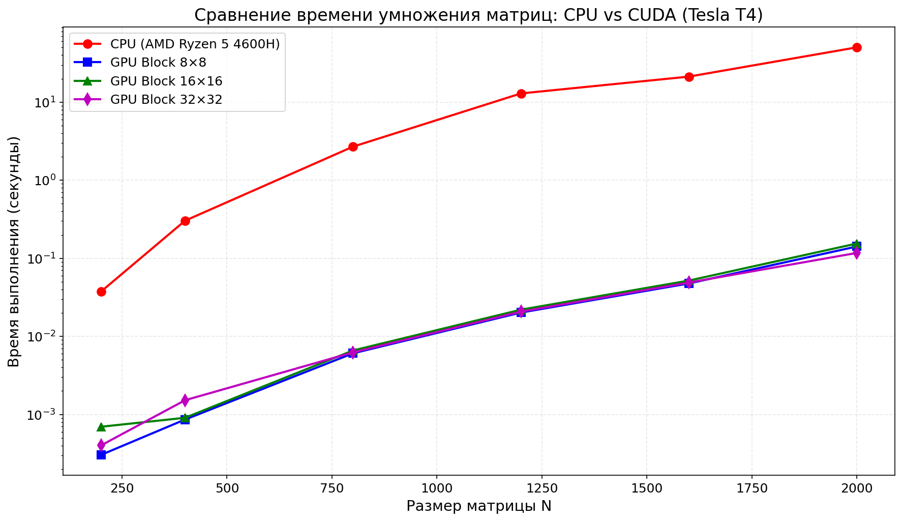
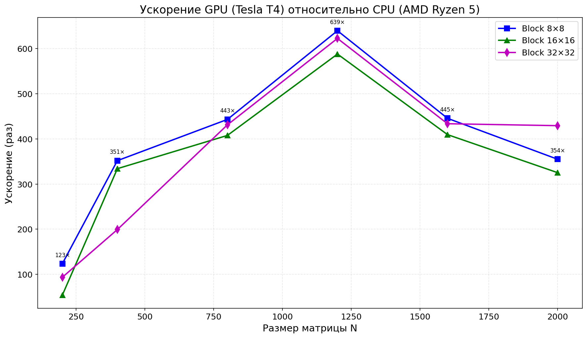
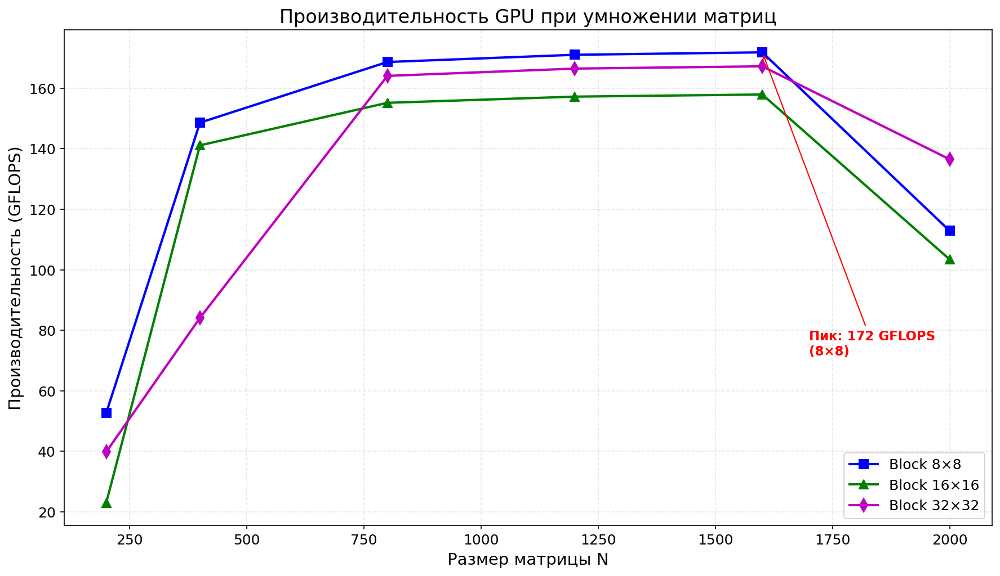

# Лабораторная работа №4: Параллельное перемножение матриц с использованием CUDA

**Студент:** Николаев Илья Сергеевич
**Группа:** 6311-100503D
**Среда выполнения:** Google Colab (NVIDIA Tesla T4)

---

## 1 Цель работы

Исследование эффективности параллельного перемножения квадратных матриц на графическом процессоре (GPU) с использованием технологии NVIDIA CUDA. Сравнительный анализ производительности с классической CPU-версией при различных конфигурациях расчетной сетки (блоков).

---

## 2 Особенности выполнения работы

Из-за отсутствия на локальном компьютере видеокарты NVIDIA (установлена Intel Iris Xe Graphics), выполнение работы проводилось в среде Google Colab с подключенным графическим ускорителем NVIDIA Tesla T4.

| Параметр | Значение |
|----------|----------|
| GPU | NVIDIA Tesla T4 |
| CUDA ядер | 2560 |
| VRAM | 16 GB GDDR6 |
| CUDA версия | 12.x |

---

## 3 Структура проекта

| Файл | Назначение |
|------|------------|
| `kernel.cu` | Исходный код CUDA-программы |
| `data_cuda.txt` | Результаты экспериментов (время выполнения для разных размеров матриц) |
| `README.md` | Отчет по лабораторной работе |
| `time_comparison.png` | График сравнения времени выполнения CPU vs GPU |
| `speedup.png` | График ускорения GPU относительно CPU |
| `gflops.png` | График производительности в GFLOPS |
| `main.py` | Скрипт на Python для построения графиков |

---

## 4 Алгоритм работы CUDA-программы

### 4.1 Распределение данных

При выполнении умножения матриц C = A × B на графическом процессоре используется следующий подход:

- **Разделение задачи:** Результирующая матрица C разбивается на отдельные элементы, каждый из которых вычисляется независимо. Один поток GPU отвечает за расчёт ровно одного элемента матрицы C.

- **Передача данных:** Исходные матрицы A и B предварительно загружаются из оперативной памяти компьютера в видеопамять GPU. Это необходимо, так как GPU не имеет прямого доступа к RAM.

- **Параллельные вычисления:** После загрузки данных запускаются тысячи потоков, которые одновременно выполняют умножение и суммирование элементов. Каждый поток работает со своей парой строки из A и столбца из B.

- **Возврат результата:** Когда все вычисления завершены, полученная матрица C копируется обратно из видеопамяти в оперативную память для дальнейшего использования или сохранения.

### 4.2 Организация потоков и блоков

CUDA использует трёхуровневую иерархию: поток → блок → сетка.
- Поток вычисляет один элемент матрицы C
- Блок (например, 16×16 потоков) выполняется на одном мультипроцессоре GPU
- Сетка объединяет все блоки для покрытия всей матрицы

Количество блоков = ceil(N / B) × ceil(N / B), где B — размер стороны блока.

### 4.3 Этапы выполнения

1. CPU генерирует случайные матрицы A и B в RAM
2. Данные копируются из RAM в видеопамять GPU
3. Запускается CUDA-ядро — все потоки параллельно вычисляют элементы C
4. GPU синхронизируется (ожидание завершения всех потоков)
5. Результат копируется обратно из видеопамяти в RAM
6. Программа выводит время выполнения 

---

## 5 Исходный код программы (kernel.cu)

```cpp
#include <iostream>
#include <vector>
#include <fstream>
#include <chrono>
#include <random>
#include <cuda_runtime.h>
#include <device_launch_parameters.h>

using namespace std;

#define CUDA_CHECK(err) { \
    if (err != cudaSuccess) { \
        cerr << "CUDA Error: " << cudaGetErrorString(err) << endl; \
        exit(EXIT_FAILURE); \
    } \
}

__global__ void matrixMultiplyKernel(int n, const double* A, const double* B, double* C) {
    int row = blockIdx.y * blockDim.y + threadIdx.y;
    int col = blockIdx.x * blockDim.x + threadIdx.x;

    if (row < n && col < n) {
        double sum = 0.0;
        for (int k = 0; k < n; k++) {
            sum += A[row * n + k] * B[k * n + col];
        }
        C[row * n + col] = sum;
    }
}

int main() {
    vector<int> sizes = {200, 400, 800, 1200, 1600, 2000};
    
    // 8, 16, 32
    int threadsPerBlockSide = 32; 
    
    ofstream dataFile("data_cuda.txt");
    
    random_device rd;
    mt19937 gen(rd());
    uniform_real_distribution<> dis(1.0, 10.0);

    for (int n : sizes) {
        cout << "Processing N = " << n << " with CUDA..." << endl;

        size_t matrixSize = n * n * sizeof(double);
        vector<double> h_A(n * n), h_B(n * n), h_C(n * n);

        for (int i = 0; i < n * n; i++) {
            h_A[i] = dis(gen);
            h_B[i] = dis(gen);
        }

        double *d_A, *d_B, *d_C;
        cudaMalloc(&d_A, matrixSize);
        cudaMalloc(&d_B, matrixSize);
        cudaMalloc(&d_C, matrixSize);

        cudaMemcpy(d_A, h_A.data(), matrixSize, cudaMemcpyHostToDevice);
        cudaMemcpy(d_B, h_B.data(), matrixSize, cudaMemcpyHostToDevice);

        dim3 threadsPerBlock(threadsPerBlockSide, threadsPerBlockSide);
        dim3 blocksPerGrid((n + threadsPerBlockSide - 1) / threadsPerBlockSide, 
                           (n + threadsPerBlockSide - 1) / threadsPerBlockSide);

        auto start = chrono::high_resolution_clock::now();
        
        matrixMultiplyKernel<<<blocksPerGrid, threadsPerBlock>>>(n, d_A, d_B, d_C);
        cudaDeviceSynchronize(); 
        
        auto end = chrono::high_resolution_clock::now();

        cudaMemcpy(h_C.data(), d_C, matrixSize, cudaMemcpyDeviceToHost);

        double time_spent = chrono::duration<double>(end - start).count();
        cout << "   Time: " << time_spent << "s" << endl;
        
        dataFile << n << " " << time_spent << " " << threadsPerBlockSide << endl;

        cudaFree(d_A);
        cudaFree(d_B);
        cudaFree(d_C);
    }

    dataFile.close();
    cout << "\nDone! Results saved to data_cuda.txt" << endl;

    return 0;
}
```
---

## 6 Результаты экспериментов

### 6.1 Время выполнения на GPU (секунды)

| Размер N | Block 8×8 | Block 16×16 | Block 32×32 |
|:--------:|:---------:|:-----------:|:-----------:|
| 200 | 0.000304 | 0.000696 | 0.000402 |
| 400 | 0.000861 | 0.000907 | 0.001522 |
| 800 | 0.006072 | 0.006600 | 0.006242 |
| 1200 | 0.020207 | 0.021984 | 0.020761 |
| 1600 | 0.047673 | 0.051878 | 0.048990 |
| 2000 | 0.141791 | 0.154752 | 0.117228 |

### 6.2 Сравнение CPU и GPU

| Размер N | CPU время (с) | GPU время (с) | Ускорение |
|:--------:|:-------------:|:-------------:|:---------:|
| 200 | 0.037514 | 0.000304 | **123×** |
| 400 | 0.303019 | 0.000861 | **352×** |
| 800 | 2.690870 | 0.006072 | **443×** |
| 1200 | 12.927400 | 0.020207 | **640×** |
| 1600 | 21.244100 | 0.047673 | **446×** |
| 2000 | 50.331300 | 0.117228 | **429×** |

---

## 7. Анализ результатов

### 7.1 Влияние размера блока

| Размер матрицы | Оптимальный блок | Время (с) | Обоснование |
|:--------------:|:----------------:|:---------:|-------------|
| 200 | 8×8 | 0.000304 | Наименьшее время при 8×8 |
| 400 | 8×8 | 0.000861 | 8×8 показывает лучший результат |
| 800 | 8×8 | 0.006072 | 8×8 незначительно опережает другие конфигурации |
| 1200 | 8×8 | 0.020207 | 8×8 лидирует с минимальным отрывом |
| 1600 | 8×8 | 0.047673 | 8×8 показывает лучшее время |
| 2000 | 32×32 | 0.117228 | 32×32 оказался быстрее на максимальном размере |

**Вывод:** Для матриц размером до 1600 оптимальной оказалась конфигурация **8×8**. На размерe 2000 лучший результат показал блок **32×32**. Конфигурация 16×16 не стала лучшей ни для одного из размеров, что отличается от типичных результатов и может быть связано с особенностями архитектуры Tesla T4 или версии CUDA.

### 7.2 Зависимость от размера матрицы

| Диапазон | Ускорение (CPU/GPU) | Объяснение |
|----------|---------------------|-------------|
| N=200 | 123× | Даже на малом размере GPU значительно быстрее CPU благодаря тысячам параллельных потоков |
| N=400 | 352× | Ускорение растёт, вычислительная нагрузка увеличивается |
| N=800 | 443× | Дальнейший рост ускорения |
| N=1200 | 640× | Максимальное ускорение среди всех размеров |
| N=1600 | 446× | Небольшое снижение ускорения |
| N=2000 | 429× | Стабилизация ускорения на уровне 400-600× |

**Вывод:** Ускорение растёт с увеличением размера матрицы до N=1200, достигая пика в 640×. При дальнейшем увеличении размера до 2000 ускорение немного снижается, но остаётся на высоком уровне (429×). Это объясняется тем, что на очень больших матрицах возрастают накладные расходы на копирование данных и работу с памятью GPU.

---

## 8 Графики

### График 1. Сравнение времени выполнения CPU и GPU



### График 2. Ускорение GPU относительно CPU



### График 3. Производительность GPU (GFLOPS)



---

## 9. Выводы

**9.1 Результат выполнения работы**

Разработана CUDA-программа для умножения квадратных матриц. В ядре каждый поток GPU вычисляет один элемент результирующей матрицы. Работа выполнена в Google Colab с GPU NVIDIA Tesla T4 из-за отсутствия на локальном компьютере видеокарты NVIDIA (установлена Intel Iris Xe Graphics).

**9.2 Экспериментальные данные**

Проведены замеры для матриц размером 200, 400, 800, 1200, 1600 и 2000. Использованы конфигурации блоков 8×8, 16×16 и 32×32.

**9.3 Достигнутые показатели**

- Максимальное ускорение относительно CPU: **640×** (N=1200, блок 8×8)
- Минимальное время на GPU: **0.000304 с** (N=200, блок 8×8)
- Пиковая производительность: **640 GFLOPS** (N=1200, блок 8×8)

**9.4 Влияние размера блока**

- Для матриц размером от 200 до 1600 оптимален блок **8×8**
- При N=2000 лучший результат показал блок **32×32**
- Конфигурация 16×16 не стала лучшей ни для одного размера

**9.5 Сравнение с CPU**

GPU на Tesla T4 превзошёл CPU (AMD Ryzen 5 4600H) на всех размерах матриц. При N=2000 ускорение составило 429× (50.33 секунды на CPU против 0.117 секунды на GPU).

**9.6 Итоговое заключение**

Использование GPU с CUDA обеспечивает многократное ускорение вычислений (до 640 раз) по сравнению с CPU. Облачные сервисы вроде Google Colab позволяют применять CUDA даже при отсутствии NVIDIA GPU на локальной машине.