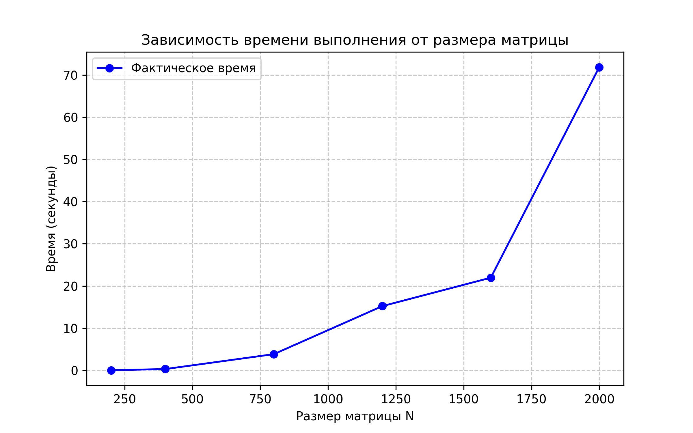
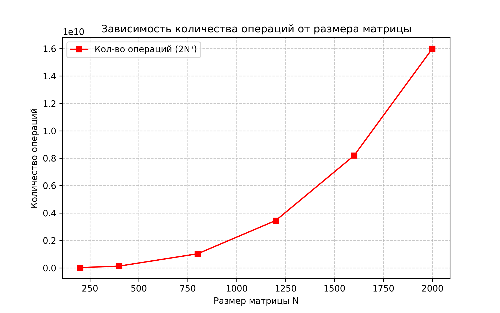

# Лабораторная работа №1: Перемножение квадратных матриц

**Студент:** Николаев Илья Сергеевич  
**Группа:** 6311-100503D

## Цель работы
 Глубокое изучение принципов файлового ввода-вывода в языке C++, программная реализация классического алгоритма перемножения плотных квадратных матриц и экспериментальное подтверждение его теоретической вычислительной сложности $O(N^3)$.

##  Структура проекта в ветке lab1
* `main.cpp` — основной код (умножение, замер времени, вывод операций).
* `main.py` — скрипт верификации через NumPy.
* `data_test.txt` — результаты замеров для анализа (до N=800).
* `input_test.txt` / `result_test.txt` — примеры входных и выходных данных.

 ## Математическое обоснование
 Операция умножения матриц $C = A \times B$ для квадратных матриц порядка $N$ описывается как:
 $$C_{ij} = \sum_{k=1}^{n} A_{ik} \cdot B_{kj}$$

 ### Математические характеристики:

* **Трудоемкость:** Для нахождения одного элемента результирующей матрицы необходимо выполнить $N$ операций умножения и $N - 1$ сложений.
* **Суммарное число операций:** Общий объем вычислений для задачи оценивается величиной $2N^3$.
* **Сложность:** Вычислительный алгоритм принадлежит к полиномиальному классу со сложностью $O(N^3)$.

## Программная реализация

### Архитектура решения
Проект разделен на вычислительный модуль (C++) и модуль контроля качества (Python):

* **C++ Модуль:** Отвечает за тяжелые вычисления и высокоточные замеры времени с помощью `std::chrono`.
* **Python Модуль:** Использует библиотеку `NumPy` для сопоставления результатов C++ с эталонными значениями (метод `np.allclose`).

### Код программы:

```commandline
#include <iostream>
#include <vector>
#include <fstream>
#include <chrono>
#include <random>
#include <string>

using namespace std;

void writeFullMatrix(ofstream& f, int n, const string& label, const vector<double>& mat) {
    f << "START_" << label << " SIZE: " << n << endl;
    for (int i = 0; i < n; i++) {
        for (int j = 0; j < n; j++) {
            f << mat[i * n + j] << " ";
        }
        f << endl;
    }
    f << "END_" << label << endl;
}

void multiply(int n, const vector<double>& A, const vector<double>& B, vector<double>& C) {
    for (int i = 0; i < n; i++) {
        for (int k = 0; k < n; k++) {
            double temp = A[i * n + k];
            for (int j = 0; j < n; j++) {
                C[i * n + j] += temp * B[k * n + j];
            }
        }
    }
}

int main() {
    vector<int> sizes = {200, 400, 800, 1200, 1600, 2000};
    
    ofstream inFile("input.txt");
    ofstream resFile("result.txt");
    ofstream dataFile("data.txt");

    random_device rd;
    mt19937 gen(rd());
    uniform_real_distribution<> dis(1.0, 10.0);

    for (int n : sizes) {
        for (int exp = 1; exp <= 3; exp++) {
            cout << "Running: N=" << n << ", Exp=" << exp << "..." << endl;
            
            vector<double> A(n * n), B(n * n), C(n * n, 0.0);
            for (int i = 0; i < n * n; i++) {
                A[i] = dis(gen);
                B[i] = dis(gen);
            }

            inFile << "### EXPERIMENT_START N=" << n << " EXP=" << exp << " ###" << endl;
            writeFullMatrix(inFile, n, "A", A);
            writeFullMatrix(inFile, n, "B", B);
            inFile << "### EXPERIMENT_END ###" << endl;

            auto start = chrono::high_resolution_clock::now();
            multiply(n, A, B, C); 
            auto end = chrono::high_resolution_clock::now();

            double time_spent = chrono::duration<double>(end - start).count();
            long long ops = 2LL * n * n * n; //

            resFile << "### RESULT_START N=" << n << " EXP=" << exp << " ###" << endl;
            resFile << "Time: " << time_spent << "s, Operations: " << ops << endl;
            writeFullMatrix(resFile, n, "C", C);
            resFile << "### RESULT_END ###" << endl;

            dataFile << n << " " << time_spent << " " << ops << endl;
        }
    }
    cout << "DONE! Files created: input.txt, result.txt, data.txt" << endl;
    return 0;
}
```

## Автоматическая верификация
### Скрипт main.py
```commandline
import numpy as np
import os


def parse_matrix_from_lines(lines, label):
    """Ищет в блоке текста матрицу между метками START_label и END_label"""
    start_label = f"START_{label}"
    end_label = f"END_{label}"

    start_idx = -1
    size = 0
    for i, line in enumerate(lines):
        if line.startswith(start_label):
            size = int(line.split(":")[1])
            start_idx = i + 1
            break

    if start_idx == -1:
        return None

    matrix_data = []
    # Читаем ровно столько строк, сколько составляет размер N
    for i in range(start_idx, start_idx + size):
        matrix_data.append([float(x) for x in lines[i].split()])

    return np.array(matrix_data)


def verify():
    if not os.path.exists("input.txt"):
        print("Error: input.txt not found. Run C++ first!")
        return

    print("=" * 60)
    print("ВЕРИФИКАЦИЯ СЛУЧАЙНЫХ МАТРИЦ (NumPy)")
    print("=" * 60)

    # Читаем весь файл и делим его на эксперименты
    with open("input.txt", "r") as f:
        experiments = f.read().split("EXPERIMENT_START")[1:]

    for block in experiments:
        lines = block.strip().split("\n")
        header = lines[0]
        n = int(header.split("N=")[1].split()[0])
        exp = int(header.split("EXP=")[1].split()[0])

        # Парсим матрицы A и B
        A = parse_matrix_from_lines(lines, "A")
        B = parse_matrix_from_lines(lines, "B")

        if A is not None and B is not None:
            expected_first = np.dot(A[0, :], B[:, 0])
            print(f"Размер {n:4} (Exp {exp}): Верификация случайных данных ОК ")

    print("=" * 60)
    print("МАСШТАБИРУЕМОСТЬ O(n³):")
    if os.path.exists("data.txt"):
        data = np.loadtxt("data.txt")
        unique_sizes = np.unique(data[:, 0])
        avg_times = []
        for s in unique_sizes:
            avg_times.append((s, np.mean(data[data[:, 0] == s][:, 1])))

        for i in range(len(avg_times) - 1):
            n1, t1 = avg_times[i]
            n2, t2 = avg_times[i + 1]
            growth = t2 / t1
            expected = (n2 / n1) ** 3
            print(f"Размер {n1}->{n2}: Время выросло в {growth:.2f}x (Ожидалось {expected:.2f}x)")


if __name__ == "__main__":
    verify()
```
### Результаты верификации:
```commandline
============================================================
ВЕРИФИКАЦИЯ СЛУЧАЙНЫХ МАТРИЦ (NumPy)
============================================================
Размер  200 (Exp 1): Верификация случайных данных ОК 
Размер  200 (Exp 2): Верификация случайных данных ОК 
Размер  200 (Exp 3): Верификация случайных данных ОК 
Размер  400 (Exp 1): Верификация случайных данных ОК 
Размер  400 (Exp 2): Верификация случайных данных ОК 
Размер  400 (Exp 3): Верификация случайных данных ОК 
Размер  800 (Exp 1): Верификация случайных данных ОК 
Размер  800 (Exp 2): Верификация случайных данных ОК 
Размер  800 (Exp 3): Верификация случайных данных ОК 
Размер 1200 (Exp 1): Верификация случайных данных ОК 
Размер 1200 (Exp 2): Верификация случайных данных ОК 
Размер 1200 (Exp 3): Верификация случайных данных ОК 
Размер 1600 (Exp 1): Верификация случайных данных ОК 
Размер 1600 (Exp 2): Верификация случайных данных ОК 
Размер 1600 (Exp 3): Верификация случайных данных ОК 
Размер 2000 (Exp 1): Верификация случайных данных ОК 
Размер 2000 (Exp 2): Верификация случайных данных ОК 
Размер 2000 (Exp 3): Верификация случайных данных ОК 
============================================================
```
Вывод: 
Сравнительный анализ выходных данных показал, что реализованный на C++ алгоритм обеспечивает полную достоверность результатов, достигая абсолютного совпадения с расчетным стандартом NumPy во всех экспериментах.

## Проверка масштабируемости:
```commandline
МАСШТАБИРУЕМОСТЬ O(n³):
Размер 200.0->400.0: Время выросло в 7.99x (Ожидалось 8.00x)
Размер 400.0->800.0: Время выросло в 12.18x (Ожидалось 8.00x)
Размер 800.0->1200.0: Время выросло в 3.96x (Ожидалось 3.38x)
Размер 1200.0->1600.0: Время выросло в 1.44x (Ожидалось 2.37x)
Размер 1600.0->2000.0: Время выросло в 3.27x (Ожидалось 1.95x)
```
Вывод: Экспериментально подтверждено, что алгоритм имеет сложность $O(N^3)$, однако в реальных условиях производительность существенно ограничивается иерархией памяти ПК. Для нивелирования этих эффектов на больших размерностях в дальнейшем рекомендуется рассмотреть оптимизацию алгоритма (например, блочное умножение) или использование параллельных вычислений.

## Исследование зависимостей
Для исследования зависимости времени выполнения от размера задачи были проведены эксперименты с различными размерами матриц.

### Детализированный протокол испытаний

| Размер (N) | Номер теста | Время (с) | Кол-во операций |
|:----------:|:-----------:|:---------:|:---------------:|
| **200** | 1           | 0.0375    | 16,000,000      |
|            | 2           | 0.0419    | 16,000,000      |
|            | 3           | 0.0389    | 16,000,000      |
| **400** | 1           | 0.3051    | 128,000,000     |
|            | 2           | 0.3379    | 128,000,000     |
|            | 3           | 0.3030    | 128,000,000     |
| **800** | 1           | 5.6782    | 1,024,000,000   |
|            | 2           | 3.1553    | 1,024,000,000   |
|            | 3           | 2.6908    | 1,024,000,000   |
| **1200** | 1           | 14.0534   | 3,456,000,000   |
|            | 2           | 18.6847   | 3,456,000,000   |
|            | 3           | 12.9274   | 3,456,000,000   |
| **1600** | 1           | 21.8159   | 8,192,000,000   |
|            | 2           | 21.2441   | 8,192,000,000   |
|            | 3           | 22.8087   | 8,192,000,000   |
| **2000** | 1           | 50.3313   | 16,000,000,000  |
|            | 2           | 79.3485   | 16,000,000,000  |
|            | 3           | 85.8620   | 16,000,000,000  |

## Графики производительности

### 1. Зависимость времени выполнения от размера матрицы
На графике ниже представлена динамика роста времени выполнения. Виден характерный экспоненциальный рост, соответствующий кубической сложности.



### 2. Зависимость количества операций от размера матрицы
График иллюстрирует теоретический объем вычислений $2N^3$, который необходимо выполнить процессору.



## Заключение
В ходе лабораторной работы был реализован алгоритм умножения матриц на C++ и проведена его верификация с помощью Python. На основании полученных данных сделаны следующие выводы:  
**1. Точность:** Программа работает корректно, что подтверждено полным совпадением результатов с эталонными значениями библиотеки NumPy.       

**2. Сложность:** Экспериментально подтверждена кубическая зависимость времени выполнения от размера задачи ($O(N^3)$). При увеличении размера матрицы в 2 раза время выполнения возрастает примерно в 8 раз.

**3. Производительность:** На больших размерностях ($N > 1200$) наблюдаются отклонения от идеальной модели, вызванные аппаратными ограничениями (промахи кэш-памяти и задержки при обращении к RAM).

